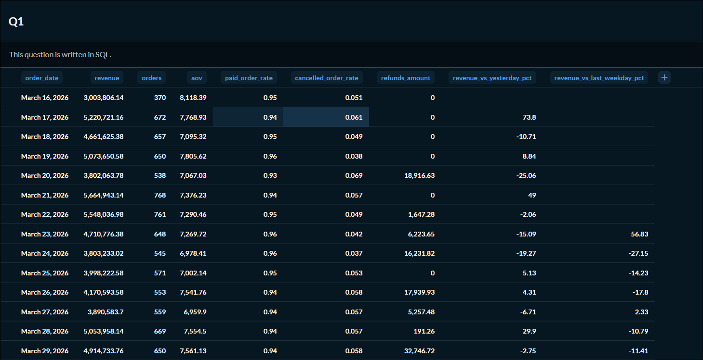
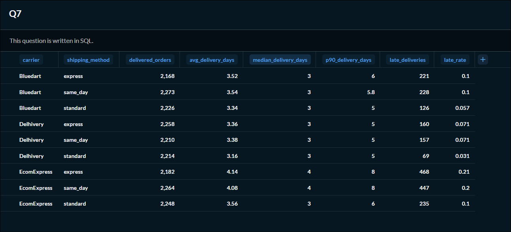
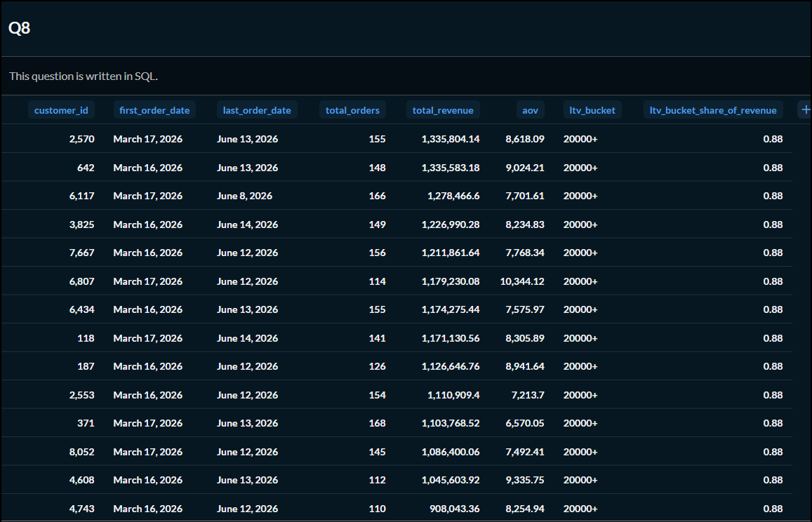

# SQL Business Insights

## Project Overview

This project analyses an e-commerce dataset using PostgreSQL to answer ten business questions across sales, customer behaviour, marketing, payments, operations, retention, and customer lifetime value. The project demonstrates how SQL can be used to generate actionable business insights for decision-making.

---

## Executive Summary

This project uses SQL to analyse business performance across sales, customer behaviour, marketing, payments, operations, and retention. The analyses identify key trends, measure business performance, and provide actionable recommendations for different stakeholders.

### Key Findings

### Key Findings

- Revenue declined because order volume decreased while average order value remained relatively stable, indicating that growth depends on increasing customer acquisition and repeat purchases.
- Customers in the ₹20,000+ lifetime value bucket contribute the majority of total revenue, highlighting the importance of customer retention and loyalty.
- Organic and Direct channels generated the highest revenue, while Email showed the strongest checkout-to-purchase conversion, suggesting opportunities to optimise marketing investments.
- Delivery performance varied across carriers, and payment failures showed recurring error patterns across payment methods, highlighting opportunities to improve operational efficiency and customer experience.

## Query Summary

| Query | SQL File                                                                                                                                                               | Stakeholder         | Business Question                                                                         | SQL Concepts Used                                         |
| ----- | ---------------------------------------------------------------------------------------------------------------------------------------------------------------------- | ------------------- | ----------------------------------------------------------------------------------------- | --------------------------------------------------------- |
| Q1    | [01_daily_business_summary.sql](https://github.com/Vibha04p/sql-business-insights/blob/main/queries/01_daily_business_summary.sql)                                     | CEO / Business Head | How is the business performing daily and compared to previous periods?                    | CTEs, Window Functions, Conditional Aggregation           |
| Q2    | [02_monthly_signup_cohort_retention.sql](https://github.com/Vibha04p/sql-business-insights/blob/main/queries/02_monthly_signup_cohort_retention.sql)                   | Growth / CRM        | How well are customers retained after signing up?                                         | Cohort Analysis, Date Arithmetic, Conditional Aggregation |
| Q3    | [03_funnel_conversion_by_acquisition_channel.sql](https://github.com/Vibha04p/sql-business-insights/blob/main/queries/03_funnel_conversion_by_acquisition_channel.sql) | CMO                 | Where do customers drop off in the conversion funnel?                                     | FILTER clause, Conditional Aggregation, CTEs              |
| Q4    | [04_top_products_net_revenue.sql](https://github.com/Vibha04p/sql-business-insights/blob/main/queries/04_top_products_net_revenue.sql)                                 | Merchandising       | Which products generate the highest net revenue after refunds?                            | CTEs, Proportional Refund Allocation, Aggregations        |
| Q5    | [05_category_health.sql](https://github.com/Vibha04p/sql-business-insights/blob/main/queries/05_category_health.sql)                                                   | Category Manager    | Which product categories generate the highest revenue and experience the most returns?    | Joins, Conditional Aggregation, Window Functions          |
| Q6    | [06_payment_failure_analysis.sql](https://github.com/Vibha04p/sql-business-insights/blob/main/queries/06_payment_failure_analysis.sql)                                 | Payments Team       | Which payment methods fail the most and what are the most common failure reasons?         | CTEs, ROW_NUMBER(), Aggregations                        |
| Q7    | [07_delivery_sla_breach.sql](https://github.com/Vibha04p/sql-business-insights/blob/main/queries/07_delivery_sla_breach.sql)                                           | Operations          | Which carriers are breaching delivery SLAs?                                                 | Percentiles, Date Arithmetic, Aggregations                |
| Q8    | [08_customer_lifetime_value.sql](https://github.com/Vibha04p/sql-business-insights/blob/main/queries/08_customer_lifetime_value.sql)                                   | CRM / Marketing     | Who are the highest-value customers and how much revenue does each LTV bucket contribute? | Window Functions, CASE Expressions, Aggregations          |
| Q9    | [09_repeat_purchase_interval.sql](https://github.com/Vibha04p/sql-business-insights/blob/main/queries/09_repeat_purchase_interval.sql)                                 | Retention Team      | How long does it take customers to place another order?                                   | LEAD(), Date Arithmetic, Window Functions               |
| Q10   | [10_attribution_comparison.sql](https://github.com/Vibha04p/sql-business-insights/blob/main/queries/10_attribution_comparison.sql)                                     | Marketing           | How does revenue differ under first-touch and last-touch attribution models?              | CTEs, Window Functions, Conditional Aggregation           |

## Sample Dashboards

### Daily Business Summary (Q1)



### Delivery SLA Breach Analysis (Q7)



### Customer Lifetime Value (Q8)


## Business Impact

The insights from this analysis can help different business teams make informed decisions:

- **Leadership:** Monitor business growth through daily revenue, order volume, and average order value trends.
- **Marketing:** Optimize customer acquisition by investing in high-performing channels and improving campaign effectiveness.
- **Customer Success:** Improve customer retention by identifying repeat purchase patterns and high-value customer segments.
- **Merchandising:** Focus on profitable products while monitoring categories with high return rates.
- **Operations:** Improve delivery performance by identifying carriers with frequent SLA breaches.
- **Payments:** Reduce payment failures by addressing recurring gateway errors and improving the checkout experience.

## Skills Demonstrated

- Advanced SQL querying
- Common Table Expressions (CTEs)
- Window Functions
- Cohort Analysis
- Funnel Analysis
- Customer Lifetime Value (LTV) Analysis
- Marketing Attribution Analysis
- Time Series Analysis
- Business KPI Reporting
- Data Validation and Quality Checks

## Challenges & Learnings

Working with a realistic e-commerce dataset required more than writing SQL queries. Throughout the project, I learned to:

- Translate business questions into measurable SQL analyses.
- Validate query outputs through sanity checks to ensure accuracy.
- Handle incomplete and inconsistent data while maintaining reliable results.
- Use window functions and CTEs to solve complex analytical problems.
- Present technical findings in a business-friendly format with actionable recommendations.
- Document the analytical process so the project can be easily understood and reproduced by others.

## Future Improvements

- Build an interactive BI dashboard using Tableau or Power BI.
- Automate recurring KPI reports.
- Add predictive models for customer churn and lifetime value.
- Expand marketing attribution using multi-touch attribution models.
- Perform A/B testing analysis for marketing campaigns.


## Repository Structure

```
sql-business-insights/
│
├── queries/
├── notes/
├── images/
│   ├── q1_daily_business_summary.png
│   ├── q7_delivery_sla_breach.png
│   └── q8_customer_lifetime_value.png
├── INTERPRETATIONS.md
├── README.md
└── case_study_link.md
```

---

## Tech Stack

- PostgreSQL
- Metabase
- GitHub
- Notion
- Mermaid (ER Diagram)

---

## How to Run

1. Open the SQL file for the business question you want to analyse.
2. Execute it in PostgreSQL or the provided Metabase environment using the `ecom` schema.
3. Review the query output and accompanying business interpretation.
4. Refer to the Notion case study for detailed insights and recommendations.

---
## Metabase Collection

🔗[[ [Metabase Collection](YOUR_METABASE_PUBLIC_LINK)](https://metabase.topfolio.in/collection/95-task-1-sql-foundation)](https://metabase.topfolio.in/collection/95-task-1-sql-foundation)

---

## Notion Case Study

🔗https://acidic-green-d92.notion.site/What-10-SQL-Queries-Told-Me-About-This-Business-3a46d0d6f119809e9a99d09eaab56736?pvs=143

---

## LinkedIn

🔗 https://www.linkedin.com/in/vibha-p/

---

## Reflection

Working on this project strengthened both my SQL skills and my ability to think like a business analyst. I became more confident using CTEs, window functions, conditional aggregation, and percentile calculations to solve real business problems. More importantly, I learned to translate SQL outputs into actionable insights rather than simply reporting numbers. I also gained experience validating results through sanity checks and documenting assumptions. If I continued this project, I would explore customer segmentation, predictive modelling, and operational optimisation using additional datasets.
